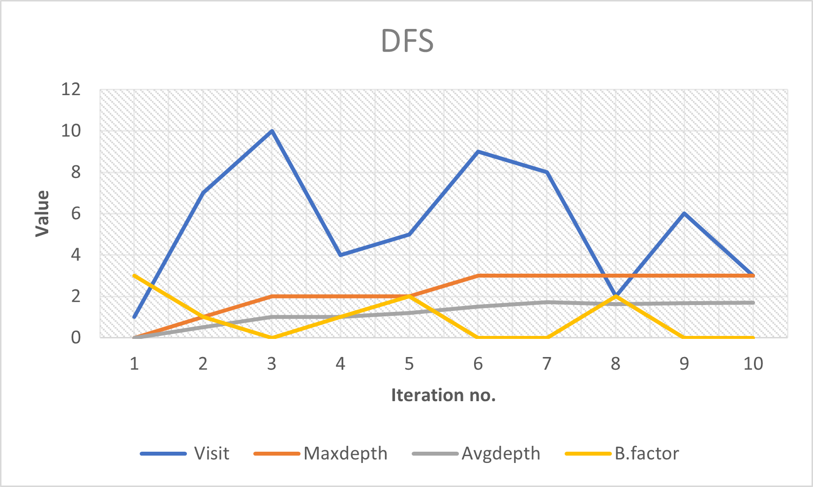
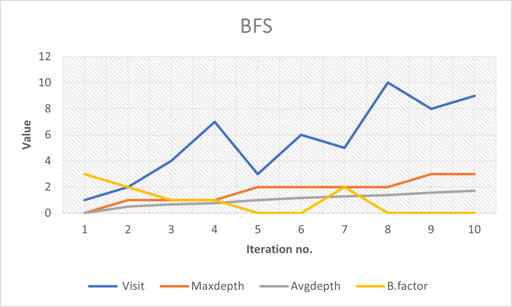
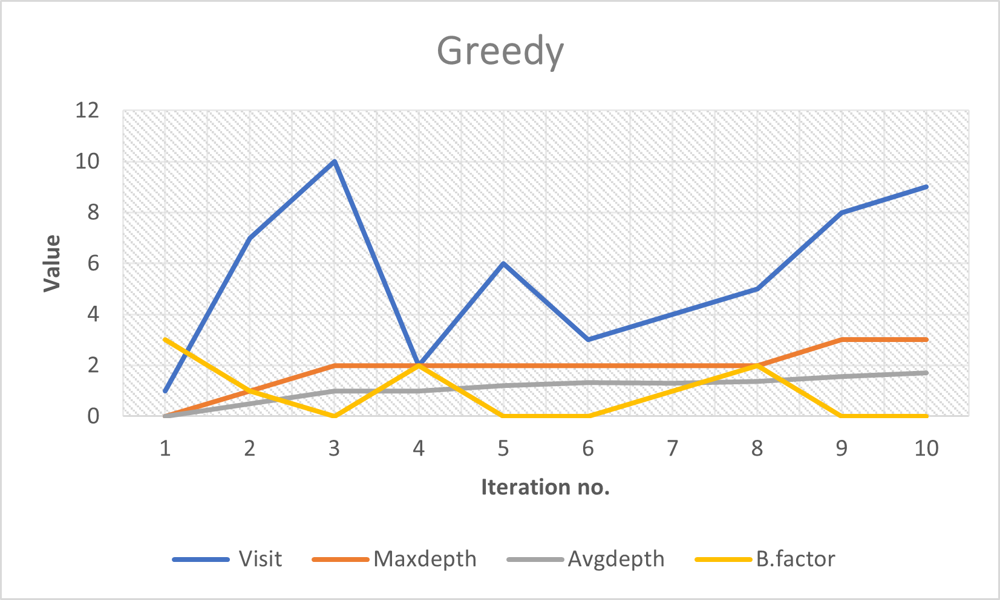
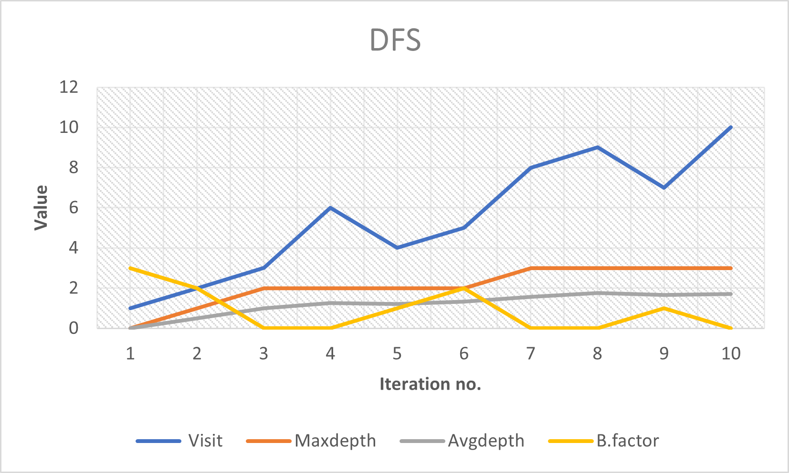
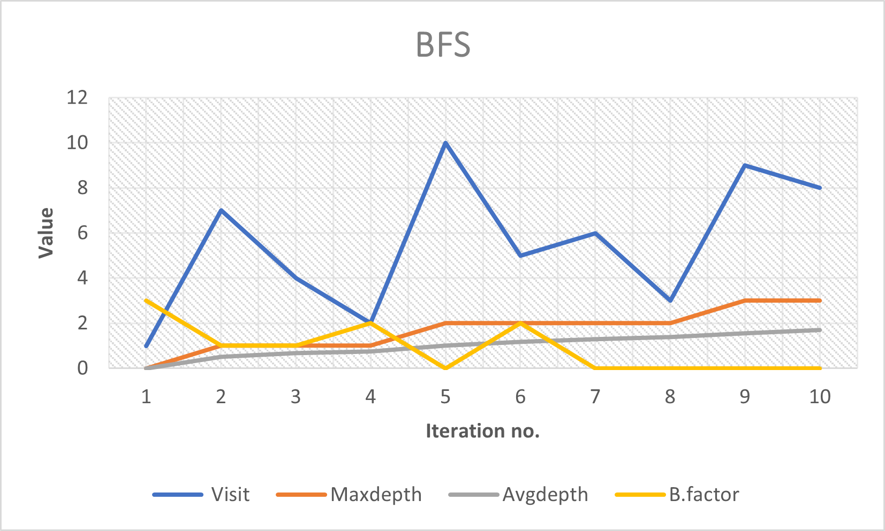
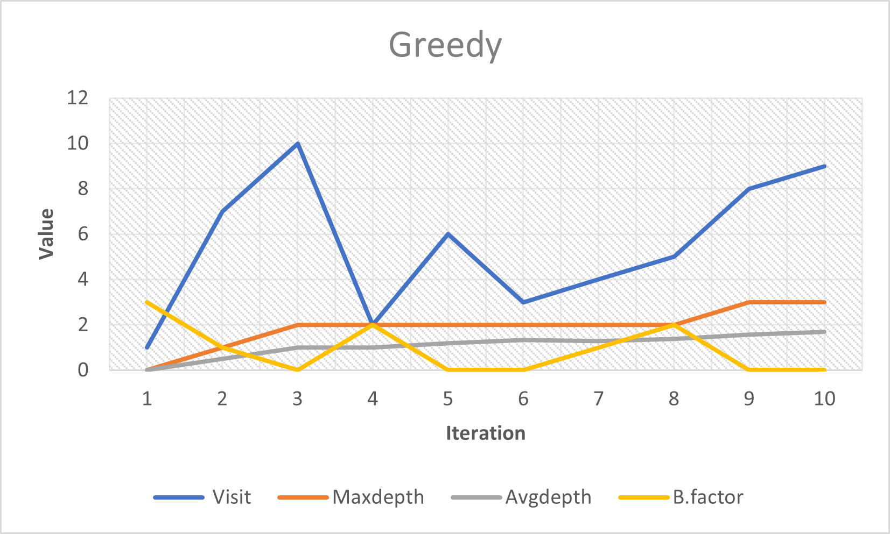

# **TREE SEARCH LIBRARY**

## _Overview_

A Generic Tree Search Library is made for exploring a Tree, created with the given input node information, using the corresponding comparator functions written based on their seen time or value, for each of the exploration strategy.
<p>The Algorithms that can be implemeneted using this Tree Search Library are DFS, BFS, A-star, Greedy-Search where the next node in each of the strategy is picked from the Priority Queue. </p>
<p>In each of the traversal, the information at that particular iteration like average depth, max depth, branching factor are stored in an array and their variation for each of the traversal is analysed and plotted.</p>

----

## **Input-Output Format**

* We need to enter the exploration strategy in CLI terminal 
```
        ./a.out <Name of exploration strategy>
        Ex. ./a.out DFS
```
<details>
           <summary>FOR VECTOR IMPLEMENTATION</summary>
           <p> Download entire repository or download the Vector_Implementation_TSL folder.</p>
           <p>Enter your input in input.txt file as per the format specified below for DFS, BFS & GREEDY strategies</p>
           <p>For A-STAR strategy, along with the format specified below...You'll also need to enter the ID for starting node as well as the target node.</p>
           <p> For this implementation, first compile by gcc final.c main.c  and after compiling run the program as per this format ./a.out [strategy name] </p>
           <p> You can choose from the 4 strategies available DFS BFS GREEDY and A-STAR. For eg. if you want to use dfs traversal type ./a.out DFS</p>
           <p>After entering strategy give the input in below specified format and press enter</p>
         </details>

 <details>
           <summary>FOR LINKEDLIST IMPLEMENTATION</summary>
           <p>Download entire repository or download the Linked-List Implementation folder.</p>
           <p>Enter your input in input.txt file as per the format specified below for DFS, BFS & GREEDY strategies</p>
           <p> For this implementation, first compile by gcc final.c main.c  and after compiling run the program as per this format ./a.out [strategy name] </p>
           <p> for this we have 3 strategy available DFS BFS and GREEDY  for eg. if you want to do dfs traversal type ./a.out DFS</p>
           <p>after entering strategy give the input in below specified format and press enter</p>
         </details>        


* Input format should be as shown:

         <number_of_nodes>:n
         <state_number> <value> <parent_state_number>
         
         ...
         ...
         n times

* The information of the node including the iteration, state number, max depth, average depth and branching factor for each iteration in the tree traversal is printed. Also tree that was created is printed with each parent along with corresponding children in the ascending order of their state values.
* Global array Output Format:
     
        <iteration> <state_number> <max_depth> <avg_depth> <Branching_Factor>

        ...
        ...
        n times

- - - - 

## **Algorithms Implemented**

### **DFS**:

* In Depth First Traversal(DFS) starting with root node, we explore all the branches as far as possible before backtracking the nodes.

* DFS is widely used algorithm in graphs and has many applications like detecting a cycle in graph, finding strongly connected components,topological Sorting, finding the existence of path between two nodes and so on.

 
### **BFS**:

* In Breadth First Traversal(BFS) starting with root node, we explore all the neighbouring nodes and then go to next depth level and explore all the nodes at that level and continue this till all the nodes at the maximum depth are explored.

* BFS algorithm is also extensively used like in Social Networking Websites, GPS Navigation systems, MST in graphs and so on.

### **Greedy Search**:

* In our Greedy Search algorithm always the nodes with more data value are explored at each level till it reaches the maximum depth and followed by backtracking the nodes with the same strategy.

* Greedy Search Algorithm is useful where we need to select the best option available at that moment without worrying about the future result it would bring like in case of Kruskal's algorithm,Dijkshtra algorithm,single source shortest path problem in graphs, and in many more.

### **A-STAR**:

* A-STAR search algorithm one of the best techniques used in path-finding and graph traversals. Since here we have a tree search library, we made certain modifications to A* search. A* Search algo is a smart algorithm which decides the next point of traversal based on certain parameters and heuristics which are not only predefined but also get updated as the traversal through the Tree takes place. We have modified this algo to traverse only those nodes which lie on shortest path from starting node to destination node. Edge length over here is defined as |val(parent_node) - val(current node)|. To predefine the heuristic h, we have also made use of Floyd Warshall algorithm to precompute the shortest path between all pairs of nodes.
* The algorithm efficiently plots a walkable path between multiple nodes, or points, on the graph. On a map with many obstacles, pathfinding from points start to end can be difficult. For example, a robot will continue on its path until it encounters an obstacle. With A*, a robot would instead find a best possible path and simultaneously avoiding the obstacles on its intended path. A* is an extension of Dijkstra's algorithm with some characteristics of breadth-first search (BFS). This algorithm is also put into use in many games which makes use of maps and best possible route to destination node.

- - - - 

## Graphs for vector implementation
### DFS

### BFS

### GREEDY


- - - - 

## Graphs for linked list implementation
### DFS

### BFS

### GREEDY


- - - - 

### Contributers **TEAM 58**

* #### **Greeshma**  
* #### **Yash**
* #### **Nikhil** 
* #### **Sanyam**
* #### **Astitva** 


# **THANK YOU !!!**
[Go to Top](##Overview "Goto heading-2")